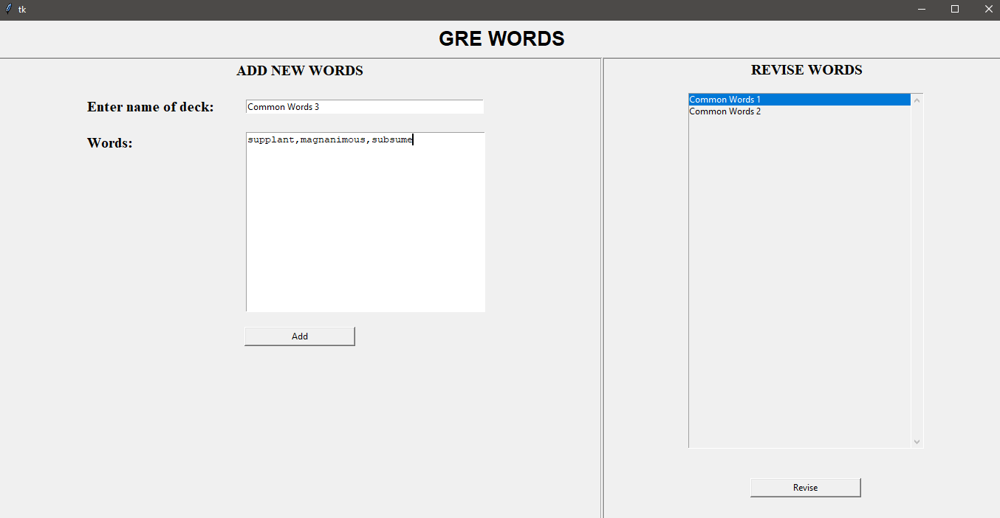
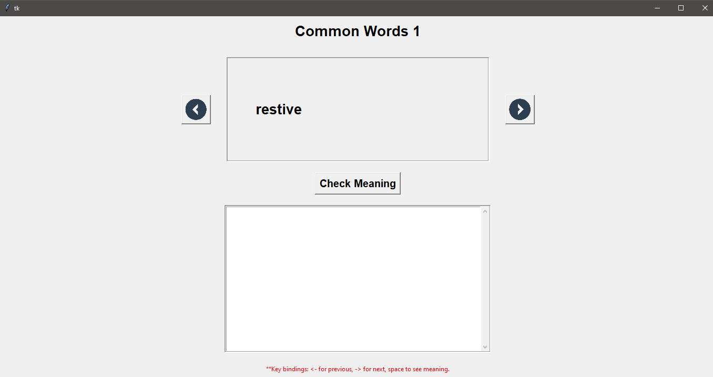

# Flashcard GUI using Tkinter

This is a flashcard software that I made to store the words that I find difficult and later can revise them. the project is made using the tkinter module. Apart from this the I have also used BeautifulSoup module for web scraping the definition of the word. To convert the .py file to .exe application I have used pyinstaller.

# Features!

  - Add custom decks of words - so no need to form a single long list of all the words. Words should be added with a comma as a separator.
  - No need to add the definitions - the software will do that for you!
  - Revise a particular deck - see the word and flip the card to check the meaning.
  - Everytime you revise a particular deck it is randomly shuffled - helping in better learning.

### Installation

Simply download the repository and go to dist -> flashcard.exe to run the application.
** In some cases your antivirus system might detect it as a virus and delete the .exe file. If this happens then you can put the .exe file in your antivirus whitelist.

### Further Improvements

- Progress bar to indicate the time it is going to take to add the new words
- Ability to delete already existing decks
- Back Button
- Better interface
